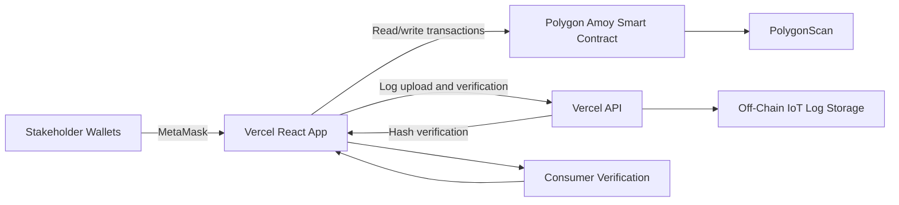

# Blockchain-Based Cold Chain Provenance System for Pharmaceutical Shipments

## Project Description

This project is a blockchain-powered provenance system for temperature-sensitive pharmaceutical shipments. It tracks a batch from manufacturer registration through custody transfer, condition logging, retailer delivery, regulator verification, recall handling, and public consumer verification.

The system uses a Polygon Amoy smart contract for the auditable proof trail and a Vercel-hosted web app for stakeholder interaction. Large IoT condition files are kept off-chain, while their `keccak256` hashes and summaries are anchored on-chain for tamper-evidence.

## Live Application

Live app:

```text
https://coldchain-provenance.vercel.app
```

Deployed Polygon Amoy contract:

```text
0xAFdcF244CAb9d632946c42A07463F3105B605EF0
```

PolygonScan contract link:

```text
https://amoy.polygonscan.com/address/0xAFdcF244CAb9d632946c42A07463F3105B605EF0
```

## MetaMask Network

Add or select this network in MetaMask before using stakeholder wallets.

| Field | Value |
| --- | --- |
| Network name | `Polygon Amoy Testnet` |
| RPC URL | `https://rpc-amoy.polygon.technology/` |
| Chain ID | `80002` |
| Currency symbol | `POL` |
| Block explorer URL | `https://amoy.polygonscan.com/` |

The grader wallets have Polygon Amoy test `POL` for gas. Test `POL` has no real-world value and is only used to pay transaction fees on the Amoy testnet.

## Grader Wallets

A funded Polygon Amoy test wallet set has been prepared for live grading. Import the private keys from the Canvas submission notes into MetaMask using `Import Account`, then switch MetaMask to `Polygon Amoy Testnet`.

Private keys are not committed in this public repository. The public addresses below are derived from the grader wallet keys and are already role-enabled on the deployed contract.

| Stakeholder | Public Wallet Address | Live Contract Role |
| --- | --- | --- |
| Admin | `0x9287E3aAB5c5939845409fd7C16044FA7eBE3B1e` | `Admin` |
| Manufacturer | `0xd4c2cF2D15b9c482d2Bd1E531Ac965A4281703e7` | `Manufacturer` |
| Distributor | `0xbcB91166e79365aC9F356969F604010c3e144bF3` | `Distributor` |
| Retailer | `0xa2Dd43ff5436F310db632B24fCB9E2BE865a3cc1` | `Retailer` |
| Regulator | `0x5557841ceF7A1d7911F65e147f5a004DeCDeB0eC` | `Regulator` |
| Customer | `0xEa5b6aDe8B95f326c2A5853872789247863CB419` | Public read-only |

The consumer/customer flow does not require a wallet role. `Consumer Verify`, QR trace lookup, and tamper-evidence checks are public read-only flows.

## Live Testing Steps

1. Import the grader private keys into MetaMask using `Import Account`.
2. Switch MetaMask to `Polygon Amoy Testnet`.
3. Open [https://coldchain-provenance.vercel.app](https://coldchain-provenance.vercel.app).
4. Click `Connect Stakeholder Wallet`.
5. Connect the admin wallet and open `Admin Access` to confirm stakeholder role assignments.
6. Switch to the manufacturer wallet and reconnect in the app.
7. Open `Register Batch` and create a fresh batch ID, for example `BATCH` plus the current date and time.
8. Open `Transfer Custody` and transfer the batch to the distributor address.
9. Switch to the distributor wallet and reconnect.
10. Open `Status Update` and mark the batch as `Shipped`.
11. Open `Condition Logs`, generate or upload an IoT condition log, and anchor the condition proof on-chain.
12. Open `Transfer Custody` and transfer the batch to the retailer address.
13. Switch to the retailer wallet and reconnect.
14. Open `Status Update` and mark the batch as `Received` or `Delivered`.
15. Switch to the regulator wallet and reconnect.
16. Open `Regulator Review` and add a verification record or recall the batch if testing exception handling.
17. Open `Batch Trace` to review the full provenance record.
18. Open `Consumer Verify` to view the simplified public verification result.
19. Open `Tamper Check`, load the latest condition proof, and run hash verification.

## Supported Live Flows

- Role-based stakeholder access through MetaMask and smart contract permissions
- Admin role management for manufacturer, distributor, retailer, and regulator wallets
- Pharmaceutical batch registration
- Custody transfer between stakeholder wallets
- Shipment and delivery status updates
- IoT condition log generation or upload
- Off-chain IoT log hashing with on-chain proof anchoring
- Regulator verification and recall handling
- Consumer verification without a required wallet role
- QR route lookup for public batch verification
- Tamper-evidence checking by recomputing the off-chain file hash

## Stakeholder Responsibilities

| Stakeholder | Main Actions |
| --- | --- |
| Admin | Grants or removes stakeholder roles |
| Manufacturer | Registers a batch and transfers initial custody |
| Distributor | Receives shipment, updates status, anchors IoT condition logs, and transfers custody |
| Retailer | Receives and marks final delivery |
| Regulator | Adds compliance verification and can recall a batch |
| Consumer | Uses public verification and QR trace lookup |

The connected wallet determines access. If a wallet has no assigned role, it can still use the public read-only pages but cannot perform restricted blockchain transactions.

## Tamper-Evidence Flow

The `Tamper Check` page verifies that the off-chain IoT file still matches the digest anchored on-chain.

1. Enter a batch ID with at least one condition log.
2. Click `Load Latest Condition Proof`.
3. The app reads the latest on-chain condition record.
4. Click `Run Hash Verification`.
5. The backend fetches the stored IoT log, recomputes its `keccak256` hash, and compares it with the on-chain digest.
6. A valid unmodified file shows `MATCH`.
7. A changed or different file shows `MISMATCH`.

This check is read-only and does not require a blockchain transaction.

## Architecture



## On-Chain vs Off-Chain Data

On-chain data:

- Batch ID, product metadata, manufacturer, current custodian, lifecycle status, and recall state
- Custody transfer history
- IoT condition log hash, URI, breach flag, and summary
- Regulator verification records
- Recall records

Off-chain data:

- Raw IoT JSON or CSV condition logs
- Parsed temperature statistics and metadata used by the backend API

This split keeps the smart contract auditable while avoiding expensive storage of large sensor files on-chain.

## Smart Contract Summary

The deployed contract is `SupplyChainProvenance`. It supports:

- `registerBatch`
- `transferCustody`
- `updateStatus`
- `recordCondition`
- `addVerification`
- `recallBatch`
- `getBatch`
- `getCustodyHistory`
- `getConditionHistory`
- `getVerificationHistory`
- `getRecallInfo`

Contract events include:

- `BatchRegistered`
- `CustodyTransferred`
- `StatusUpdated`
- `ConditionRecorded`
- `VerificationAdded`
- `BatchRecalled`

The contract is verified on PolygonScan, so grader transactions and emitted events can be inspected from the explorer link above.

## Grading Notes

Use a fresh batch ID for each test run to avoid `Batch already registered` errors. A simple format such as `BATCH20260501A` works well.

If MetaMask does not show the expected role after switching accounts, disconnect or logout in the app, switch the selected MetaMask account, then click `Connect Stakeholder Wallet` again.

If a transaction fails because of gas, confirm the wallet is on `Polygon Amoy Testnet` and has test `POL`. The prepared grader wallets were funded for live testing.

The app supports role-based stakeholder access, batch registration, custody transfer, IoT condition anchoring, regulator verification, recall handling, consumer verification, QR trace lookup, and tamper-evidence hash checking.

## Why Blockchain Helps

Pharmaceutical cold-chain shipments involve multiple organizations that need to trust the same custody and condition history. A blockchain-based design provides a shared, append-only audit trail where custody transfers, condition proofs, verifications, and recalls can be independently checked by stakeholders and consumers.

The system still keeps raw IoT data off-chain for cost and scalability reasons. The blockchain is used for accountability, tamper-evidence, and role-based workflow enforcement rather than as a bulk data store.

## Optional Backup: Local Setup and Deployment

The live application above is the primary grading path. This section is included only as a backup if the grader wants to inspect, test, or redeploy the project from source.

### Prerequisites

- Node.js 20 or later
- npm
- MetaMask browser extension
- Polygon Amoy test `POL` only if redeploying or writing transactions on Amoy
- A PolygonScan API key only if verifying a new deployed contract

### Install Dependencies

Install dependencies in all three project areas:

```bash
npm ci
npm ci --prefix backend
npm ci --prefix frontend
```

### Run Tests

Run the smart contract tests:

```bash
npm run test:contract
```

Run the backend API tests:

```bash
npm --prefix backend test
```

Run the frontend tests:

```bash
npm --prefix frontend test
```

Run all major test suites:

```bash
npm run test:all
```

Build the frontend production bundle:

```bash
npm --prefix frontend run build
```

### Local Environment Files

Create a root `.env` only if deploying or interacting with Polygon Amoy from the command line:

```text
AMOY_RPC_URL=https://rpc-amoy.polygon.technology/
PRIVATE_KEY=<deployer private key>
ADMIN_ADDRESS=<admin wallet address>
POLYGONSCAN_API_KEY=<optional polygonscan api key>
```

Create `backend/.env` only if running the backend outside Vercel:

```text
PORT=4000
CORS_ORIGIN=http://localhost:5173
AZURE_SQL_SERVER=<optional server>.database.windows.net
AZURE_SQL_DATABASE=<optional database name>
AZURE_SQL_USER=<optional sql username>
AZURE_SQL_PASSWORD=<optional sql password>
AZURE_SQL_ENCRYPT=true
AZURE_STORAGE_CONNECTION_STRING=<optional azure storage connection string>
AZURE_STORAGE_CONTAINER=iot-logs
```

Create `frontend/.env` only if running the frontend outside Vercel:

```text
VITE_RPC_URL=http://127.0.0.1:8545
VITE_BACKEND_URL=http://localhost:4000
VITE_CONTRACT_ADDRESS=
VITE_BASE_PATH=/
```

Do not commit `.env` files, wallet private keys, API keys, database passwords, or storage connection strings.

### Run Locally with Hardhat

Start a local Hardhat blockchain:

```bash
npm run node
```

In a second terminal, deploy the contract to the local Hardhat network:

```bash
npm run deploy:local
```

In a third terminal, start the backend:

```bash
npm run dev:backend
```

In a fourth terminal, start the frontend:

```bash
npm run dev:frontend
```

Open the frontend URL printed by Vite, usually:

```text
http://localhost:5173
```

For local testing, import Hardhat test accounts into MetaMask, switch MetaMask to a local Hardhat network using RPC `http://127.0.0.1:8545` and chain ID `31337`, then use the app the same way as the live workflow.

### Redeploy to Polygon Amoy

The already deployed grading contract is:

```text
0xAFdcF244CAb9d632946c42A07463F3105B605EF0
```

Redeployment is not required for grading. If a new testnet deployment is needed, make sure the deployer wallet has Amoy test `POL`, configure the root `.env`, then run:

```bash
npm run deploy -- --network amoy
```

The deploy script prints the new contract address and writes the latest deployment details to:

```text
frontend/public/demo-contract.json
```

If the web app should point to a new Amoy contract, set Vercel environment variables accordingly:

```text
VITE_RPC_URL=https://rpc-amoy.polygon.technology/
VITE_CONTRACT_ADDRESS=<new deployed Amoy contract address>
```

Leave `VITE_BACKEND_URL` blank on Vercel so the frontend uses same-domain `/api` routes.

### Verify a New Contract on PolygonScan

The grading contract is already verified on PolygonScan. For a new deployment, verify with the deployed contract address and the admin constructor argument:

```bash
npx hardhat verify --network polygonAmoy <new deployed contract address> <admin wallet address>
```

After verification, PolygonScan can decode contract functions and events such as `BatchRegistered`, `CustodyTransferred`, `ConditionRecorded`, `VerificationAdded`, and `BatchRecalled`.
